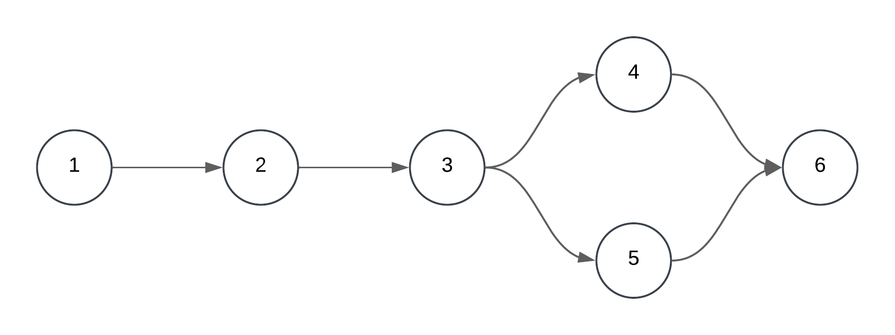

# Teste de caixa branca
- Este repositório tem como objetivo, realizar 4 etapas do teste de caixa branca utilizando a classe User como objeto de estudo.
- A seguir tem-se todas as etapas realizadas para o teste, abaixo tem-se os erros apontados na classe e em seguida os critérios de caixa branca.
- No repositório também há a planilha de teste utilizada para registros e o código contido na pasta caixaBranca.

## Erros
- Na linha 15, a exceção não é tratada corretamene, pois o bloco catch está vazio, fazendo com que, caso uma exceção seja gerada, não haverá retorno nenhum.
- Na linha 19, a propriedade "nome" é pública, sendo possível modificá-lo em qualquer parte do projeto.
- Na linha 20, o mesmo problema do tópico anterior é válido para a propriedade result.
- Na linha 35, o mesmo problema do primeiro tópico se faz presente
- Outro problema do código, são os métodos da classe User, que deveriam ser apenas getters e setters, seguindo o Princípio da responsabilidade única do SOLID, o método de conexão com o banco deveria estar em uma classe dedicada para conexão com o banco
- Seguindo a ideia do tópico anterior, o método verificarUsuário deveria estar em uma classe de Serviços como UserService, dedicado a processos relacionados a classe usuário.
## Critérios de Caixa Branca
### Grafo de Fluxo

### Cálculo de complexidade ciclomática
- M = E − N + 2P
- M = 6 - 6 + 2
- M = 2
### Base de Caminhos
- Caminho 1: 1 -> 2 -> 3 -> 4 -> 6
- Caminho 2: 1 -> 2 -> 3 -> 5 -> 6
